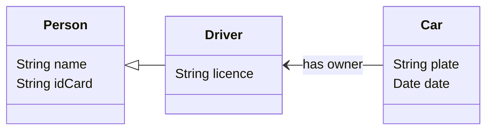

# MyApi (v2)
A REST API to interact with information regarding persons, drivers and their cars.
Similar to [MyApi (v1)](https://github.com/catarinafoliveira/myApi_v1), but using classes and MVC.



## Prerequisites
[NodeJS](https://nodejs.org/en/download/prebuilt-installer/current)

## Installation
Use the command line inside the project's folder:

```bash
npm install
```

## Usage
Run the project in VSCode, with or without debugging, or run in the command line inside the project's folder:

```bash
node app.js
```

## Test
To test the API use, for example,
[Postman](https://www.postman.com/downloads/) and the following routes:

### Persons routes:
| Type     | Route        | Description         |
| ----     | -----        | -----------         |
| `POST`   | /api/persons | Create a new person |
| `GET`    | /api/persons | Show all persons    |
| `GET`    | /api/persons/id/:id | Get a person by ID |
| `GET`    | /api/persons/name/:name | Get a person by name |
| `GET`    | /api/persons/idcard/:idcard | Get a person by ID card |
| `PUT`    | /api/persons/:id | Edit a person |
| `DELETE` | /api/persons/:id | Delete a person |

### Driver routes:
| Type     | Route        | Description         |
| ----     | -----        | -----------         |
| `POST`   | /api/drivers | Create a new driver |
| `GET`    | /api/drivers | Show all drivers    |
| `GET`    | /api/drivers/id/:id | Get a driver by ID |
| `GET`    | /api/drivers/name/:name | Get a driver by name |
| `GET`    | /api/drivers/idcard/:idcard | Get a driver by ID card |
| `GET`    | /api/drivers/dl/:dl | Get a driver by driver's licence |
| `PUT`    | /api/drivers/:id | Edit a driver |
| `DELETE` | /api/drivers/:id | Delete a driver |

### Cars routes:
| Type     | Route        | Description         |
| ----     | -----        | -----------         |
| `POST`   | /api/cars | Create a new car |
| `GET`    | /api/cars | Show all cars    |
| `GET`    | /api/cars/id/:id | Get a car by ID |
| `GET`    | /api/cars/plate/:plate | Get a car by plate |
| `GET`    | /api/cars/owner/:dl | Get a car by owner driver's licence |
| `PUT`    | /api/cars/:id | Edit a car |
| `DELETE` | /api/cars/:id | Delete a car |
